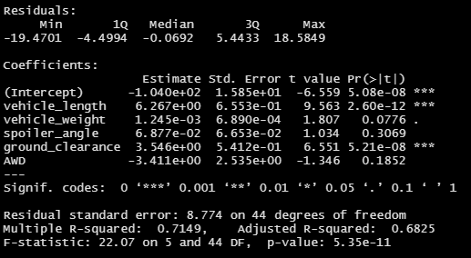

# MechaCar Statistical Analysis

## Overview
We use R, calling in the `dplyr` and `tidyverse` libraries to investigate production data for AutosRUs' new prototype, MechaCar. At this stage, we are investigating which factors contribute most to MechaCar's fuel efficiency, as well as evaluating the consistency of suspension coils.  We are also beginning to design a study to compare MechaCar's performance to vehicles from other manufacturers.

## Analysis
### Linear Regression to Predict MPG
<!-- 
    Which variables/coefficients provided a non-random amount of variance to the mpg values in the dataset?  vehicle length and ground clearance, as well as intercept
    Is the slope of the linear model considered to be zero? Why or why not? not 0, because p-value is vv small, so we can reject the null hypothesis
    Does this linear model predict mpg of MechaCar prototypes effectively? Why or why not?  nope, lack of significant factors (or abundance of insignificant factors) points to overfitting
-->
To begin, we use R's `lm()` function to perform a multiple linear regression on [MechaCar's MPG data](MechaCar_mpg.csv).  This regression calculates how MPG relates to vehicle length, vehicle weight, spoiler angle, ground clearance, and if the vehicle has all wheel drive or not.  The summary of this regression is displayed below.

From examining the P-values, we see that vehicle length and ground clearance, as well as the intercept, are very unlikely to contribute to random variance, meaning that their contribution to variance is significant and meaningful.  Our overall p-value is well within our 0.05 significance level, at 5.35e-11, so we can confirm the slope of our model is non-zero.  Despite this being a valid model for the current dataset, this model may not predict future values reliably.  We have several factors that we've fit for that do not contribute significantly to the model, so our model is likely overfit.

### Summary Statistics on Suspension Coils
<!-- 
The design specifications for the MechaCar suspension coils dictate that the variance of the suspension coils must not exceed 100 pounds per square inch. Does the current manufacturing data meet this design specification for all manufacturing lots in total and each lot individually? Why or why not?   Yes for most, no for Lot 3.  Variance, a calculated value, is wayyy too high, with a standard deviation of 13 (7 of 50 values are potential outliers based on IQR, potential manufacturing issues
-->
Design specifications for suspension coils dictate that their variance must not exceed 100 pounds per square inch (PSI).  We calculated summary statistics for the coils in [Suspension_Coil.csv](Suspension_Coil.csv), the results of which are displayed here:

As we can see, the variance for all coils is 62.29, which is under the 100 PSI limit.  We then proceeded to look more closely and calculate the same summary statistics for each lot.  Lots 1 and 2 have very small variance, 0.98 and 7.47 PSI respectively.  Lot 3, on the other hand, has a variance of 170.00 PSI.  Looking at the box-and-whisker plot below, we see that there are 8 potential outliers in Lot 3 based on the interquartile range (IQR), out of the 50 total samples from that lot. 

### T-Tests on Suspension Coils
<!-- summarize your interpretation and findings for the t-test results. Include screenshots of the t-test to support your summary 
Only lot 3 has significant variation from average-->
Finally, we used a Student's T-Test using the `t.test()` function to determine if our samples were meaningfully different from the mean population.  The population mean was 1500, and as in the previous section, we performed the test on all of our samples (upper left), Lot 1 (upper right), Lot 2 (lower left), and Lot 3 (lower right). 

Continuing to use a significance level of 0.05, we see that Lot 3 is the only group to have a significant difference from the population mean.  This agrees with what we saw by examining variance, confirming that Lot 3 experienced some production issues.  Lot 1, on the other hand, has a p-value of 1, with a sample mean equal to the population mean.

## Study Design: MechaCar vs Competition
<!--     Write a short description of a statistical study that can quantify how the MechaCar performs against the competition. In your study design, think critically about what metrics would be of interest to a consumer: for a few examples, cost, city or highway fuel efficiency, horse power, maintenance cost, or safety rating.
    In your description, address the following questions:

    What metric or metrics are you going to test?  highway and city fuel efficiency
    What is the null hypothesis or alternative hypothesis?  null: no meaningful difference between MechaCar and Competition  alternative: significant difference between MechaCar and competition
    What statistical test would you use to test the hypothesis? And why?  either two sample t-test or ANOVA, depending on how many competitors we're comparing against
    What data is needed to run the statistical test?  fuel efficiencies from many vehicles (preferably of multiple vehicle classes/styles (ie sedan, coupe, etc)) from functionally similar trips (don't want huge variation in temperature, drive time, drive distance, etc)
-->
While improving MechaCar's based on internal metrics is important, we also want to compare this prototype to other vehicles on the market.  With gas prices fluctuating but generally high, fuel efficiency is a key selling factor, so highway and city fuel efficiency are the first factors we'd like to dig into.  To do this, we will use ANOVA testing to compare groups of vehicles.  Preferably, the data being compared will be collected from many vehicles of multiple vehicle classes (sedan, coupe, etc.), driven for similar distances under similar conditions.  Time lingering at stop lights, extreme temperature differences, and driving speed, among many other factors, can all significantly affect fuel efficiency, so we would want to control as many of those variables as possible.  ANOVA is the best standard test I know for comparing the means of many groups.  In ANOVA testing, our null hypothesis is that all sample means are the same, and our alternative hypothesis is that at least one sample is different.  In our case, we are especially focused on whether or not MechaCar is signifanctly different from the other samples.
